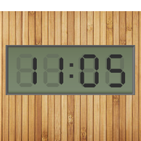

Wooden LCD Watch Face
=====================

Watch Face for SmartQ Z Smartwatch with a vintage wooden panel and a 7-segment monochrome LCD look. It may also be used for watches with a screen resolution of 240x240 and will show up as a widget

Screenshot
----------

Installation
------------
Connect your Smartwatch, enable developer options (tapping Model Number 5 times under Settings->About). After installing Android SDK, go to `platform-tools` and check if the smartwatch is being shown :

    $ ./adb devices
    List of devices attached
    Indroid device
    
    $ ./adb install woddenlcdwatchface.apk
    ...
    Success
    
After the installation is complete, the watch launcher will refresh and you will have the option to choose your new watchface :)

Credits
-------
1. [Rones](https://openclipart.org/detail/190202/lcd-by-rones-by-rones-190202) for LCD numerals
2. [clericJ](http://forum.xda-developers.com/search.php?searchid=329482748) for watch face samples